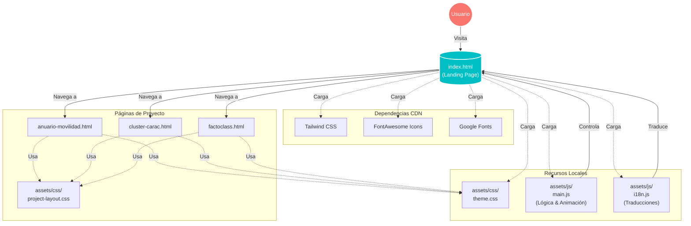

# Portfolio PCDCN

Static, bilingual (ES/EN) portfolio for Data Science/Statistics. Pure HTML + Tailwind CDN with a canvas hero animation, scroll-in effects, and a slot for D3 visualizations.

## Quick start
- View online: https://pcdelcampon.github.io/portfolio/
- Open `index.html` in your browser.
- Optional local server: `python -m http.server 8000` (then go to `http://localhost:8000`).
- Change language with the flag buttons; text keys live in `assets/js/i18n.js`.
- To publish, drop the files on any static host (GitHub Pages, Netlify, Vercel, S3, etc.).

## Project structure
- `index.html`: landing page (hero, about, portfolio, viz lab, contact) with Tailwind config in the head.
- `project_template.html`: clone for each case study; keep the layout and swap the copy/assets.
- `assets/js/main.js`: hero canvas network animation, IntersectionObserver scroll reveals, mobile nav toggle, placeholder for a D3 skill chart.
- `assets/js/i18n.js`: language dictionaries and flag toggle logic; persists preference in `localStorage`.
- `assets/js/charts/`: reserved for extra visualizations.
- `assets/img/`: portfolio images (e.g., `ClusterCarac_IA001.png`) and avatars.
- `assets/css/`: empty by default if you want local styles instead of CDN-only.

## Architecture Overview

## Features
- Hero canvas with particle/line animation and mouse interaction.
- ES/EN toggle with instant text swap and saved preference.
- Responsive Tailwind layout with scroll-in animations.
- **Optimized Navigation**: Smooth scrolling with directional arrows for better UX.
- Dedicated Viz Lab block for D3 experiments (currently hidden/placeholder).
- Reusable case-study template page.

## Customize
- Theme: edit the `tailwind.config` script block inside the HTML head to adjust colors/typography.
- Hero animation: change `particleCount`, `connectionDistance`, and `mouseDistance` in `assets/js/main.js`.
- Skills chart: fill in `initSkillChart` in `assets/js/main.js` or add scripts under `assets/js/charts/`.
- Copy: update dictionaries in `assets/js/i18n.js` for both languages; add new keys as needed.
- Projects: duplicate `project_template.html`, update content, and link it from `index.html`.

## Notes
- Fully static; no build step or dependencies required.
- Windows users may see LF/CRLF notices when staging if `core.autocrlf` is on.

Thanks to VibeCoding. You help me to make this portfolio ... XD
