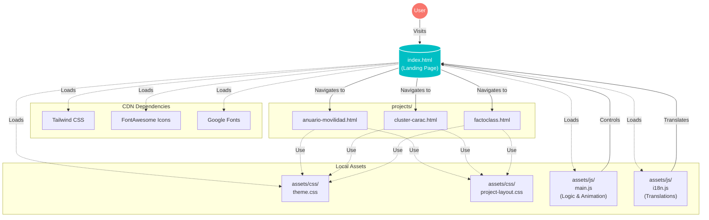

# Portfolio PCDCN

Static, bilingual (ES/EN) portfolio for Data Science/Statistics. Pure HTML + Tailwind CDN with a canvas hero animation, scroll-in effects, and a slot for D3 visualizations.

## Quick start
- View online: https://pcdelcampon.github.io/portfolio/
- Open `index.html` in your browser.
- Optional local server: `python -m http.server 8000` (then go to `http://localhost:8000`).
- Change language with the flag buttons; text keys live in `assets/js/i18n.js`.
- To publish, drop the files on any static host (GitHub Pages, Netlify, Vercel, S3, etc.).

## Project structure

- `index.html`: Main landing page (hero, about, portfolio, contact) with Tailwind config in the head.
- `project_template.html`: Template to clone for new case studies; maintains layout consistency.
- `projects/`: Directory containing individual project pages.
    - `anuario-movilidad.html`: Bogotá Road Casualty Yearbook.
    - `cluster-carac.html`: ClusterCarac package.
    - `factoclass.html`: FactoClass package.
- `assets/`:
    - `css/`:
        - `theme.css`: Global styles and overrides.
        - `project-layout.css`: Specific styles for project internal pages.
    - `js/`:
        - `main.js`: Core logic for animations (canvas), scroll observers, and navigation.
        - `i18n.js`: Internationalization dictionaries (ES/EN) and language toggle logic.
        - `charts/`: Reserved for additional visualization scripts.
    - `img/`: Portfolio images and assets.

## Architecture Overview

```mermaid
graph TD
    %% Nodes
    User((User))
    Index[("index.html\n(Landing Page)")]
    
    subgraph Assets [Local Assets]
        CSS_Theme["assets/css/\ntheme.css"]
        CSS_Proj["assets/css/\nproject-layout.css"]
        JS_Main["assets/js/\nmain.js\n(Logic & Animation)"]
        JS_i18n["assets/js/\ni18n.js\n(Translations)"]
    end
    
    subgraph External [CDN Dependencies]
        TW[Tailwind CSS]
        FA[FontAwesome Icons]
        GFonts[Google Fonts]
    end

    subgraph Portfolio [projects/]
        P1[anuario-movilidad.html]
        P2[cluster-carac.html]
        P3[factoclass.html]
    end

    %% Connections
    User -->|Visits| Index
    
    Index -.->|Loads| CSS_Theme
    Index -.->|Loads| JS_Main
    Index -.->|Loads| JS_i18n
    Index -.->|Loads| TW
    Index -.->|Loads| FA & GFonts
    
    JS_Main -->|Controls| Index
    JS_i18n -->|Translates| Index
    
    Index -->|Navigates to| P1
    Index -->|Navigates to| P2
    Index -->|Navigates to| P3
    
    P1 & P2 & P3 -.->|Use| CSS_Proj
    P1 & P2 & P3 -.->|Use| CSS_Theme
    
    style Index fill:#00bfc4,stroke:#fff,stroke-width:2px,color:#fff
    style User fill:#f8766d,stroke:#fff,stroke-width:2px,color:#fff
```

## Features
- Hero canvas with particle/line animation and mouse interaction.
- ES/EN toggle with instant text swap and saved preference (localStorage).
- Responsive layout using Tailwind CSS with scroll-in animations.
- **Optimized Navigation**: Smooth scrolling with directional arrows for better UX.
- Reusable case-study template system.

## Customization
- **Theme**: Edit `tailwind.config` in `index.html` head to adjust colors/fonts, or `assets/css/theme.css` for custom CSS.
- **Hero Animation**: Adjust `particleCount`, `connectionDistance`, and `mouseDistance` in `assets/js/main.js`.
- **Content**: Update text dictionaries in `assets/js/i18n.js` for bilingual support.
- **New Projects**: 
    1. Duplicate `project_template.html`.
    2. Renaissance and move to `projects/` folder.
    3. Ensure asset links in the new file point to `../assets/`.
    4. Link the new page from the portfolio section in `index.html`.

## Notes
- Fully static; no build step or dependencies required.
- Windows users may see LF/CRLF notices when staging if `core.autocrlf` is on.

Thanks to VibeCoding. You help me to make this portfolio ... XD
